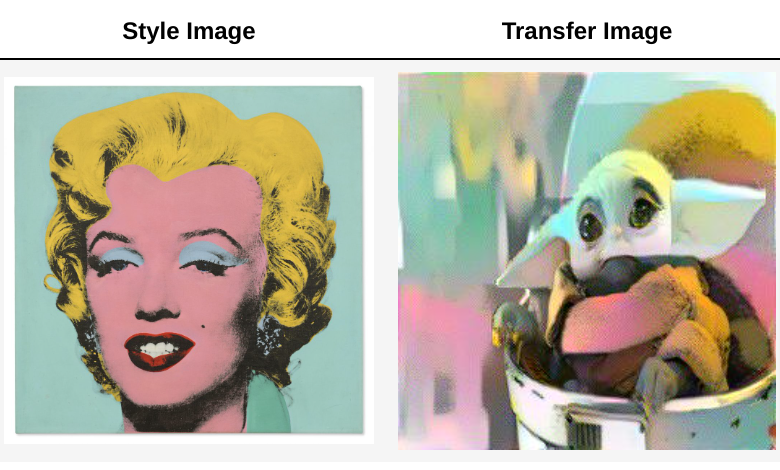

# Determined AI Model Training Hackathon - Neural Style Transfer: from Warhol to Star Wars 

In this project, we built a customized CNN model using Determined AI Platform that realizes image style transfer and created an Andy Warhol painting style Grogu(from Star Wars) profile picture.



## 1. Inspiration

Style transfer neural networks has been an integral part of computer vision AI community. It allows artists and designers to explore their creativity expression freely and produce visually appealing yet unique content. Futhermore, image stye transfer is open to anyone with internet access so it creates a sense of personalization in the community that promopts computational creativity. With more images generated using the AI models, more stylized content can be used in various applications, such as video games, virtual simulations, and interactive media.

In recent years, there have been a blossom of image style transfer applications. For example, [web broswer baed arbitrary style transfer](https://reiinakano.com/arbitrary-image-stylization-tfjs/), [Fast Neural Style Transfer
](https://huggingface.co/spaces/aravinds1811/neural-style-transfer) by [Hugging Face](https://huggingface.co/) or [Neural Style Transfer Online & Free Tool](https://makeoptim.com/en/deep-learning/style-transfer-online/). However, they all face the similar problems: model is not very ustomizable(meaning user cannot define imprtant metrics such as content and style transfer weight), and its usage has limits(how many times can you call its model training API or how fast can the image rendering be done, or how to ensure the best result is chosen).

In this Hackathon project, we hope to explore how determined AI platform can assist such model training process in a more efficient way(i.e. distributed/parallel processing with higher utilization of clusters and computing platforms such as AWS or GCP), and how we can freely train a more flexible, customized image style transfer model. 


## 2. What it does

Image style transfer is the process of transfering the style of original image, called **style image**, typically meaning the artistic characteristics, to another, called **content image**.

There are several different styles of image transfer that can be achieved using various algorithms and techniques. Some common styles of image transfer include:  brushwork,  color palette,  geometric shapes, fragmented forms, graphic patterns and outlines. 

Typically, for a moderate image style transfer model, it can achieve decent style transfer for any two images(style image & content image) no matter which style is has. 

In this project, the trained model can transfer whichevr style defined by the user and apply it to another. We will use a famous Andy Warhol painting(pop art) as style, and transfer it to a Star Wars character(photography). 

## 3. How we built it

### 3.1. Setup

#### (Option 1): Determined Cloud + virtualenv

```shell
virtualenv venv 

source venv/bin/activate

pip install determined

det --version

(venv) user@pop-os:~/Documents/code/determined-ai$ det --version
det 0.21.1
```
#### (Option 2): Determined Docker

```shell
docker --version
Docker version 23.0.3, build 3e7cbfd
```

### 3.2. Model Architecture

The model archiecture consists of one data norm layer, the loss calculation and features(ONLY) of a pretrained VGG model(obtained from [torch.vision](https://pytorch.org/vision/)) and assembed using `torch.nn.Sequential`.

The order of each layer inside the container is:

```
Sequential(
  (0): Normalization()
  (conv_1): Conv2d(3, 64, kernel_size=(3, 3), stride=(1, 1), padding=(1, 1))
  (style_loss_1): StyleLoss()
  (relu_1): ReLU()
  (conv_2): Conv2d(64, 64, kernel_size=(3, 3), stride=(1, 1), padding=(1, 1))
  (style_loss_2): StyleLoss()
  (relu_2): ReLU()
  (pool_2): MaxPool2d(kernel_size=2, stride=2, padding=0, dilation=1, ceil_mode=False)
  (conv_3): Conv2d(64, 128, kernel_size=(3, 3), stride=(1, 1), padding=(1, 1))
  (style_loss_3): StyleLoss()
  (relu_3): ReLU()
  (conv_4): Conv2d(128, 128, kernel_size=(3, 3), stride=(1, 1), padding=(1, 1))
  (content_loss_4): ContentLoss()
  (style_loss_4): StyleLoss()
  (relu_4): ReLU()
  (pool_4): MaxPool2d(kernel_size=2, stride=2, padding=0, dilation=1, ceil_mode=False)
  (conv_5): Conv2d(128, 256, kernel_size=(3, 3), stride=(1, 1), padding=(1, 1))
  (style_loss_5): StyleLoss()
)

```

## 4. Challenges we ran into

1. Setup and Configuration: thisis the first time we use Determined AI Platform so the installation of dependencies, setting up environments, and configuring various settings can be a bit time-consuming.

2. Hyperparameter Tuning: it requires multiple rounds of experiments and trailand error to find the best performing models.

3. Combining customized loss function and pre-trained CNN model and obtained desired results. 

## 5. Accomplishments that we're proud of

1. Prototype: a functional prototype in limited time(found out about the competition last week) with image demo and notebook for reference. This is also the first time I use determined AI platform so it took some time to get used to the tool and set up the environment.

2. AI Model Training: the model architecture is very simple yet effective, its training process is also fairly straightforward with complemented logs(including loss step-by-step) 

3. Innovation: this project developed a creative solution combined with Determined AI for a well-known prob;em. It addresses a real-world challenge in a unique and effective way.

4. User-Centric Approach: image style transfer is all about personalization and user creativity. Build based on previous models and prototypes, this project is highly customizable with customizable weights(for content and style images) and optimizer steps and guidelines. 


## 6. What we learned

1. Hyperparameter Tuning such as learning rate, weight decay, and max-epochs.
2. Determined AI Platform for model management and tracking training progress.
3. Efficient distributed model training: how to define model tuning and effectively use 3rd party platforms. 

## 7. What's next

In the future, this neural style transfer model is expected to adapt to more user customization and features. Also, reliability and model robustness should also be investigated.

